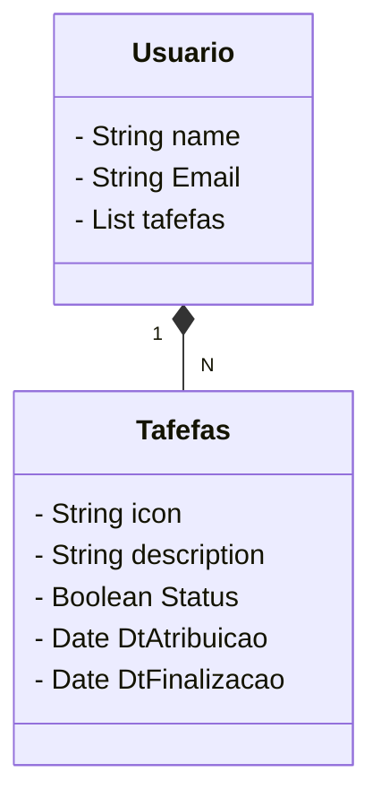

# Desafio final Santander Dev week 2023.

Idéia: Criar uma RESTful Api Java com Spring Boot, para exercitar os conceitos adquiridos durante as aulas. 
Observação: Escolher um domínio qualquer.

# Ferramentas utilizadas.

- [Spring Initializr](https://start.spring.io/)
- Spring Boot versão 3.1.4
- Java 17
- Packaging: jar
- Maven dependencies --> Spring Data JPA, Spring Web, PostgreSQL Driver, H2 Database e springdoc-openapi-starter-webmvc-ui.
- 
- ssh.exe
- git e GitHub

 

## Diagrama de Classes

# RESTFul Api Gerênciador de Tarefas.

Um usuário tem uma lista de tarefas, para gerênciar seus projetos ou qualquer tipo de tarefas.

