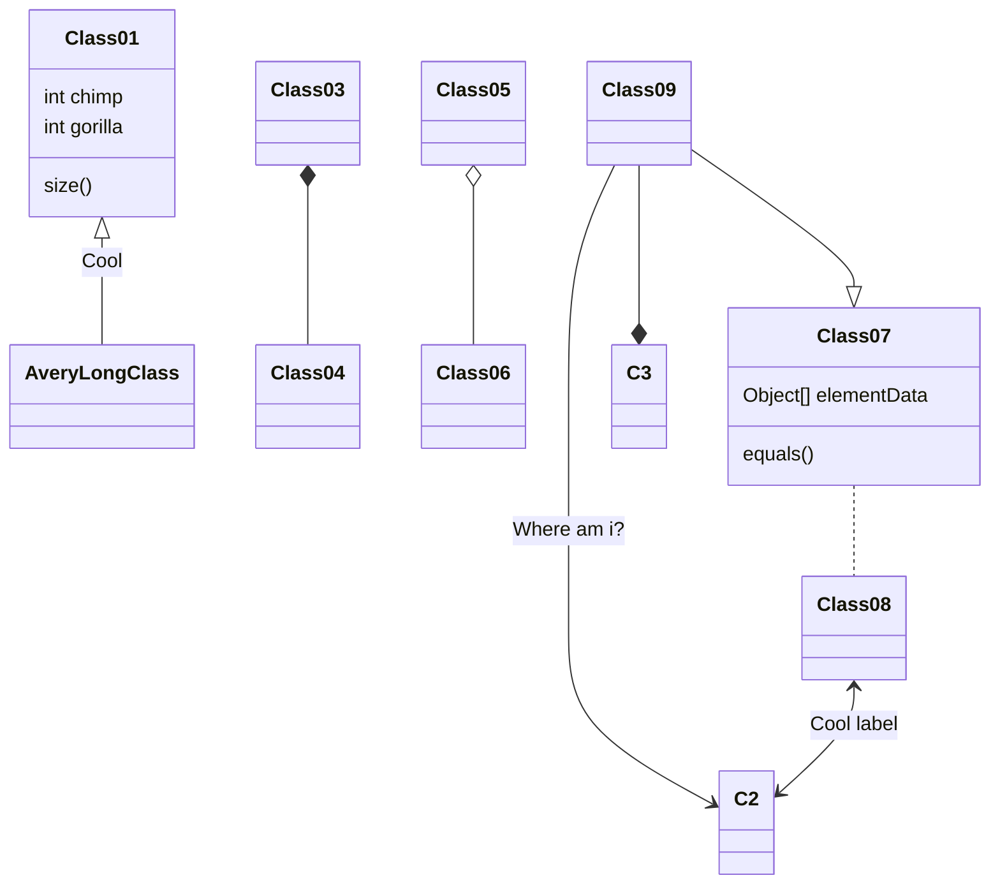

# Desafio-final- Santander Dev week 2023.

Idéia: Criar uma RESTful Api Java com Spring Boot, para exercitar os conceitos adquiridos durante as aulas. 
Observação: Escolher um domínio qualquer.

# Ferramentas utilizadas.

- [Spring Initializr](https://start.spring.io/)
- Spring Boot versão 3.1.4
- Java 17
- Packaging: jar
- ssh.exe

## Diagrama de Classes

# Sistema Gerênciador de Tarefas.

